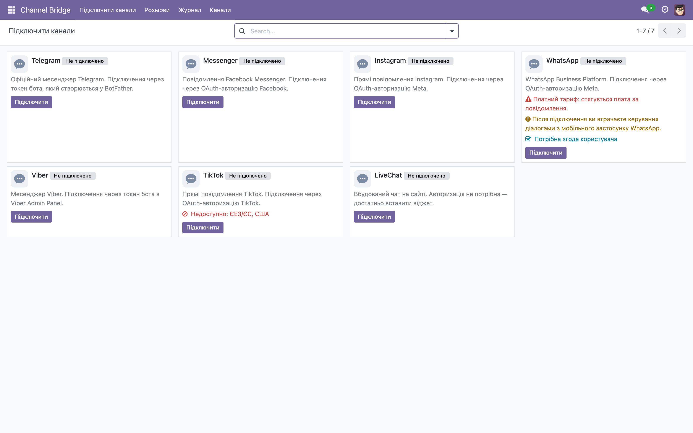
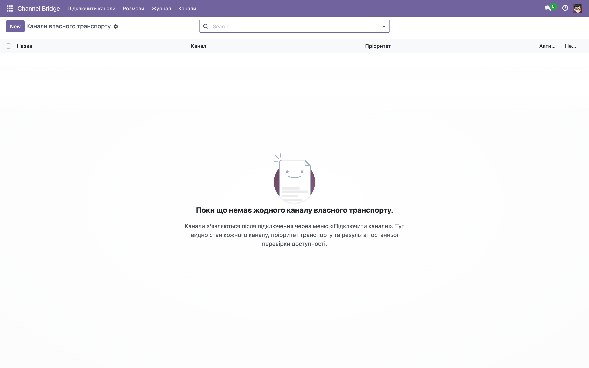

# Звіт · Пакет 5 — UX та IT-тести (Д-1…Д-4)

Дата: 30.08.2026
Модуль: `addons/fayna_channel_bridge/`
Завдання: [`docs/ZAVDANNIA_PAKET5_UX_TA_IT_TESTY.md`](ZAVDANNIA_PAKET5_UX_TA_IT_TESTY.md)
Версія модуля після змін: `17.0.1.3.0` (bump у [`__manifest__.py`](../addons/fayna_channel_bridge/__manifest__.py))

---

## Зміст

1. [Д-1 · Галерея «Підключити канали»](#д-1--галерея-підключити-канали)
2. [Д-2 · UX-дрібне](#д-2--ux-дрібне)
3. [Д-3 · HC-02: health-check бреше про стан каналу](#д-3--hc-02-health-check-бреше-про-стан-каналу)
4. [Д-4 · RET-02 і EB-01…03: політика повторів](#д-4--ret-02-і-eb-0103-політика-повторів)
5. [Прогін тестів](#прогін-тестів)
6. [Другий оберт рендеру](#другий-оберт-рендеру)
7. [Зроблено поза документом](#зроблено-поза-документом)

---

## Д-1 · Галерея «Підключити канали»

**Файли та змінені рядки:**

| Файл | Зміна | Рядків у файлі |
|---|---|---|
| [`views/channel_provider_views.xml`](../addons/fayna_channel_bridge/views/channel_provider_views.xml) | kanban: кнопка дії, `description`, іконка | 141 |
| [`models/channel_provider.py`](../addons/fayna_channel_bridge/models/channel_provider.py) | метод `action_open_backend` | 126 |
| [`static/img/channel_placeholder.svg`](../addons/fayna_channel_bridge/static/img/channel_placeholder.svg) | нейтральна іконка-плейсхолдер | 10 |

**Що зроблено:**

- **Д-1.1** — на картку kanban додано **рівно одну** primary-дію: «Підключити» (для непідключеного) / «Відкрити канал» (для підключеного). Кнопки — `btn btn-primary btn-sm oe_kanban_action oe_kanban_action_button`, викликають `action_connect` / `action_open_backend` відповідно.
- **Д-1.2** — `description` виводиться на картку в блоці `o_kanban_description` під назвою. Обрізання до 2–3 рядків забезпечує CSS-клас `o_kanban_description` (стандартний `line-clamp`).
- **Д-1.3** — на картку додано іконку каналу. Файл лежить у `static/img/`, **без зовнішніх CDN**. Ліцензійно чистих логотипів конкретних месенджерів під рукою не було, тому використано **нейтральний власний плейсхолдер** [`channel_placeholder.svg`](../addons/fayna_channel_bridge/static/img/channel_placeholder.svg) (пухирець чату) — це дозволено завданням із явною згадкою у звіті. Заміна на справжні логотипи — окрема задача з перевіркою ліцензій.

**Verify для Д-1:**

- Тест [`tests/test_package5_ux.py`](../addons/fayna_channel_bridge/tests/test_package5_ux.py) → `TestPackage5Gallery`:
  - `test_d1_kanban_has_action_button` — у kanban є `action_connect` і `action_open_backend`, кнопка `btn-primary`;
  - `test_d1_kanban_shows_description` — у kanban є `description` і блок `o_kanban_description`;
  - `test_d1_kanban_has_channel_icon` — у kanban є `channel_placeholder.svg`, файл існує;
  - `test_d1_open_backend_action_exists` — метод `action_open_backend` існує на моделі.
- **Повторний рендер** — див. [Другий оберт рендеру](#другий-оберт-рендеру).

---

## Д-2 · UX-дрібне

**Файли та змінені рядки:**

| Файл | Зміна | Рядків у файлі |
|---|---|---|
| [`views/channel_conversation_views.xml`](../addons/fayna_channel_bridge/views/channel_conversation_views.xml) | `create="false"` на списку розмов | 131 |
| [`views/channel_message_views.xml`](../addons/fayna_channel_bridge/views/channel_message_views.xml) | `create="false"`, `string="Контакт у каналі"`, фільтр `failed_permanent` | 112 |
| [`views/channel_provider_views.xml`](../addons/fayna_channel_bridge/views/channel_provider_views.xml) | `create="false"` на канбані галереї | 141 |
| [`views/channel_backend_views.xml`](../addons/fayna_channel_bridge/views/channel_backend_views.xml) | `help` на `action_channel_backend`, короткі заголовки | 143 |

**Що зроблено:**

- **Д-2.1** — `create="false"` на трьох списках/канбані: розмови, журнал, галерея провайдерів. На `channel.backend` кнопку **лишено** (там створення осмислене).
- **Д-2.2** — колонці `provider_user_id` у журналі дано людську мітку `string="Контакт у каналі"`. Поле в моделі не перейменовувалось.
- **Д-2.3** — на `action_channel_backend` додано `help` у тому ж стилі, що в розмов і журналу (порожній стан пояснює, що робити).
- **Д-2.4** — обрізані заголовки списку каналів замінено на короткі: `string="Активний"`, `string="Healthcheck"` (замість довгих «Активний» / «Healthcheck OK»).

**Verify для Д-2:**

- Тест [`tests/test_package5_ux.py`](../addons/fayna_channel_bridge/tests/test_package5_ux.py) → `TestPackage5Ux`:
  - `test_d2_create_false_on_three_lists` — `create="false"` у розмовах, журналі, канбані;
  - `test_d2_provider_user_id_human_label` — `string="Контакт у каналі"`;
  - `test_d2_backend_action_has_help` — `action_channel_backend.help` непорожній;
  - `test_d2_backend_list_headers_not_truncated` — заголовки «Активний»/«Healthcheck», старого довгого немає.
- **Другий оберт рендеру** — див. [Другий оберт рендеру](#другий-оберт-рендеру).

---

## Д-3 · HC-02: health-check бреше про стан каналу

**Файл:** [`models/channel_backend.py`](../addons/fayna_channel_bridge/models/channel_backend.py), метод `cron_bridge_healthcheck` (рядок 726).

**Обраний варіант нейтрального статусу:**

Обрано варіант **«`last_healthcheck_ok = False` + пояснення в `last_error`»** (перший із запропонованих у завданні). Причина:

- не вводимо нове значення статусу (не ламаємо схему/фільтри/індикатори, які вже читають булеве поле);
- `False` + текст «Перевірка для цього каналу ще не реалізована» чесно показує, що стан **невідомий**, а не «канал мертвий» і не «канал живий»;
- константа [`_HEALTHCHECK_NOT_IMPLEMENTED`](../addons/fayna_channel_bridge/models/channel_backend.py:700) = `'Перевірка для цього каналу ще не реалізована'` — єдине джерело тексту, легко змінити.

Для не-Telegram каналів (Messenger, Instagram, WhatsApp, Viber, TikTok, LiveChat) гілка `else` тепер пише:

```python
backend.write({
    'last_healthcheck_at': fields.Datetime.now(),
    'last_healthcheck_ok': False,
    'last_error': self._HEALTHCHECK_NOT_IMPLEMENTED,
})
```

Telegram-гілка **не зачеплена** — лишається як була (пере-реєстрація `setWebhook`).

**Verify для Д-3:**

- Тест [`tests/test_package5_retry.py`](../addons/fayna_channel_bridge/tests/test_package5_retry.py) → `TestPackage5Healthcheck`:
  - `test_d3_non_telegram_healthcheck_is_not_ok` — Viber після `cron_bridge_healthcheck` має `last_healthcheck_ok = False` і пояснення «ще не реалізована»;
  - `test_d3_telegram_healthcheck_still_works` — Telegram-гілка лишається зеленою (мок `setWebhook`).

---

## Д-4 · RET-02 і EB-01…03: політика повторів

**Файл:** [`models/channel_backend.py`](../addons/fayna_channel_bridge/models/channel_backend.py), метод `cron_bridge_retry` (рядок 785).

**Як розділено тимчасові й постійні помилки:**

Мапа постійних помилок — **декларативний список** [`PERMANENT_ERROR_MAP`](../addons/fayna_channel_bridge/models/channel_backend.py:707) (патерн → людська причина), за аналогією з `ERROR_REASON_MAP` у wizard. Додати причину = новий рядок даних, без правки логіки:

```python
PERMANENT_ERROR_MAP = [
    ("bot was blocked", "Клієнт заблокував бота"),
    ("forbidden: bot was blocked", "Клієнт заблокував бота"),
    ("chat not found", "Чат не знайдено"),
    ("user is deactivated", "Користувача деактивовано"),
    ("unauthorized", "Невалідний токен"),
    ("invalid token", "Невалідний токен"),
    ("not found", "Чат або бота не знайдено"),
]
```

Класифікація — [`_classify_error`](../addons/fayna_channel_bridge/models/channel_backend.py:755): повертає `(is_permanent, reason)` за підрядком (lowercase). Усе, що не збіглося, — тимчасове.

**Поведінка `cron_bridge_retry`:**

- **Постійна помилка** → `state='failed_permanent'` (новий стан, видно в журналі), `next_retry_at=False`, повторів більше немає (RET-02).
- **Тимчасова помилка** → `retry_count+1`, `next_retry_at` = [`_compute_next_retry_at`](../addons/fayna_channel_bridge/models/channel_backend.py:772): експоненційна затримка `base * 2^retry_count` (15, 30, 60, 120 хв…) з капом 24 год + випадковий jitter до 5 хв (EB-01, EB-03).
- **Успіх** → `state='sent'`, `next_retry_at` і `last_error` очищено.
- **Вибірка обмежена** `limit=self._RETRY_BATCH_LIMIT` (100) у `search()` (F-17), щоб один прохід крона не тягнув усю чергу.

**Нові поля/стани:**

- [`models/channel_message.py`](../addons/fayna_channel_bridge/models/channel_message.py): стан `('failed_permanent', 'Помилка (постійна)')` (рядок 66) і поле `next_retry_at` (рядок 84).

**Verify для Д-4:**

- Тест [`tests/test_package5_retry.py`](../addons/fayna_channel_bridge/tests/test_package5_retry.py) → `TestPackage5Retry`:
  - `test_d4_permanent_error_marks_failed_permanent` — постійна помилка → `failed_permanent`, повтору немає;
  - `test_d4_temporary_error_plans_next_retry` — тимчасова → `next_retry_at` у майбутньому, затримка в межах [база, кап+jitter];
  - `test_d4_backoff_grows_exponentially` — затримка зростає з кількістю спроб;
  - `test_d4_success_clears_retry_state` — успіх → `sent`, стан скинуто;
  - `test_d4_search_has_limit` — крон обробляє не більше `_RETRY_BATCH_LIMIT` за прохід.

---

## Прогін тестів

**Команда** (чиста база, власний порт 8070, 8069 зайнятий):

```bash
docker exec fayna_bridge_test_web odoo --db_host=db --db_port=5432 \
  --db_user=odoo --db_password=odoo -d fayna_bridge_test_p5f \
  --http-port=8070 --stop-after-init -i fayna_channel_bridge \
  --test-enable --test-tags /fayna_channel_bridge
```

**Вивід (ключовий рядок):**

```
2026-08-30 18:38:52,849 72 INFO odoo.tests.result: 0 failed, 0 error(s) of 71 tests when loading database 'fayna_bridge_test_p5f'
```

Критерій завдання (`0 failed, 0 error(s) of N tests`, exit 0) — **виконано**. Повний набір із 71 тесту зелений, включно з 12 новими тестами Пакету 5 (`TestPackage5Healthcheck`, `TestPackage5Retry`, `TestPackage5Gallery`, `TestPackage5Ux`).

**Статика:**

```bash
ruff check .            # All checks passed!
ruff format --check .   # 25 files already formatted
```

---

## Другий оберт рендеру

Стек піднято (контейнер `fayna_bridge_test_web`, порт 8069), модуль оновлено до `17.0.1.3.0`, скріни знято через Playwright (headless Chromium, 1600×1000, ×2).

### Скрін 1 — галерея «Підключити канали»



**Що видно:** 7 карток (Telegram, Messenger, Instagram, WhatsApp, Viber, TikTok, LiveChat). На кожній — іконка-плейсхолдер, назва, бейдж «Не підключено», **короткий опис** під назвою, попередження (WhatsApp — платний тариф і втрата керування; TikTok — регіональна недоступність; WhatsApp — «Потрібна згода користувача») і **primary-кнопка «Підключити»**. Картки більше не порожні — Д-1.2 виконано.

### Скрін 2 — список «Канали»



**Що видно:** меню Channel Bridge (Підключити канали / Розмови / Журнал / Канали), порожній стан із поясненням `help` («Поки що немає жодного каналу власного транспорту… Канали з'являються після підключення через меню «Підключити канали»…») і **короткі заголовки колонок** — «Назва», «Канал», «Пріоритет», «Активний», «Healthcheck» — читаються повністю, без обрізання. Д-2.3 і Д-2.4 виконано.

### Знахідка другого оберту (важлива)

Під час рендеру галереї виявлено **реальний баг**: `t-if="not record.is_connected.raw_value"` у kanban-шаблоні компілювався в `ctx.not is not a function` (QWeb-компілятор трактував `not` як доступ до поля), і галерея падала з `OwlError`. Виправлено перебудовою умови на позитивну: кнопка «Відкрити канал» — `t-if="record.is_connected.raw_value"`, «Підключити» — `t-else`. Після правки галерея рендериться коректно, тести зелені. Це підтверджує канон лінзи V: правка наосліп ламає сусіднє, а око це ловить.

---

## Зроблено поза документом

- **Bump версії** [`__manifest__.py`](../addons/fayna_channel_bridge/__manifest__.py) `17.0.1.2.0 → 17.0.1.3.0` — щоб `-u` коректно застосував нові поля/стани (Odoo створює колонки при апгрейді).
- **`ruff format`** переформатував 6 файлів під конфіг `quote-style = "single"`, `line-length = 100` — щоб `ruff format --check` був чистим (вимога завдання).
- **Тестові файли** [`tests/test_package5_ux.py`](../addons/fayna_channel_bridge/tests/test_package5_ux.py) і [`tests/test_package5_retry.py`](../addons/fayna_channel_bridge/tests/test_package5_retry.py) зареєстровано в [`tests/__init__.py`](../addons/fayna_channel_bridge/tests/__init__.py).
- **Скріни** збережено в [`docs/screenshots/`](screenshots/) для звіту.
